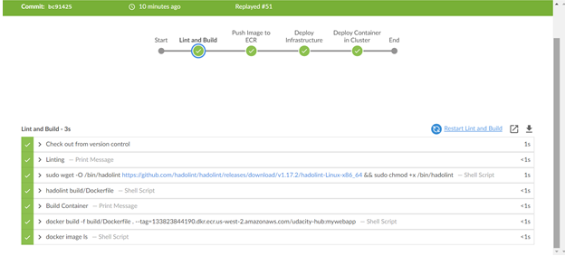
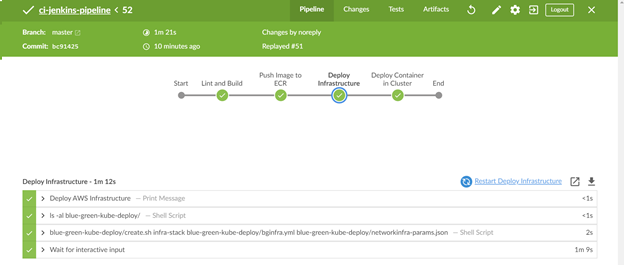
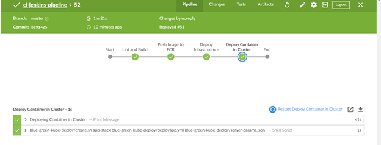
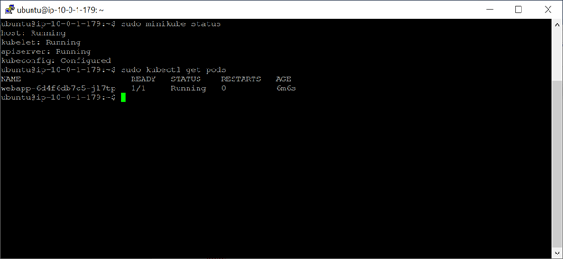

This project uses a jenkins server (an EC2 instance in AWS) and Builds and simple NGINX webserver application, containerizes the application, pushes the image to AWS Elastic Container Registry (ECR), uses AWS CloudFormation Scripts to (1) deploy a Blue/Green Deployment Infrastructure and then (2) deploys the webserver application to a Kubernetes cluster (using minikube).

## Pre-Requisites
1) Create an EC2 Instance that will host a Jenkins Automation Server
2) AWS Account
3) Github account

## ci-jenkins-pipeline Repository
https://github.com/leetsg0/ci-jenkins-pipeline
Contains the main Jenkins file defining the pipeline stages:
  1) Lint and Build Stage - performs a lint of the Dockerfile and Docker build
  2) Push to ECR Stage - does the docker push to AWS ECR for the 'dockerized' nginx application
  3) Deploy Infrastructure Stage - Runs CloudFormation script to create a blue/green deployment of AWS network infrastructure and a timeout 
                                   for a manual Deploy or start of the next stage
  4) Deploy Container in Cluster Stage - Runs CloudFormation script to create the instances that contains the container and deploys the
                                         container in a kubernetes cluster
Contains the Docker file for the NGINX webserver

## blue-green-kube-deploy Repository
Contains shell scripts and CloudFormation scripts to create and destroy CloudFormation stacks
https://github.com/leetsg0/blue-green-kube-deploy

## Project Specifications:

1) Pipeline Setup:
  a) Jenkins File: https://github.com/leetsg0/ci-jenkins-pipeline/blob/master/Jenkinsfile
  b) AWS ECR Repository, image URI: 133823844190.dkr.ecr.us-west-2.amazonaws.com/udacity-hub:mywebapp
  
2) Build Docker Container - See Jenkins Stage and Output

  
3) Successfull Deployment - The picture below show: (a) CloudFormation Script (https://github.com/leetsg0/blue-green-kube-deploy/blob/master/bginfra.yml)to deploy infrastructure, (b) CloudFormation Script (https://github.com/leetsg0/blue-green-kube-deploy/blob/master/deployapp.yml) to deploy application and kubernetes cluster, (c) Screenshot showing minikube started and deployed app in kubernetes.

